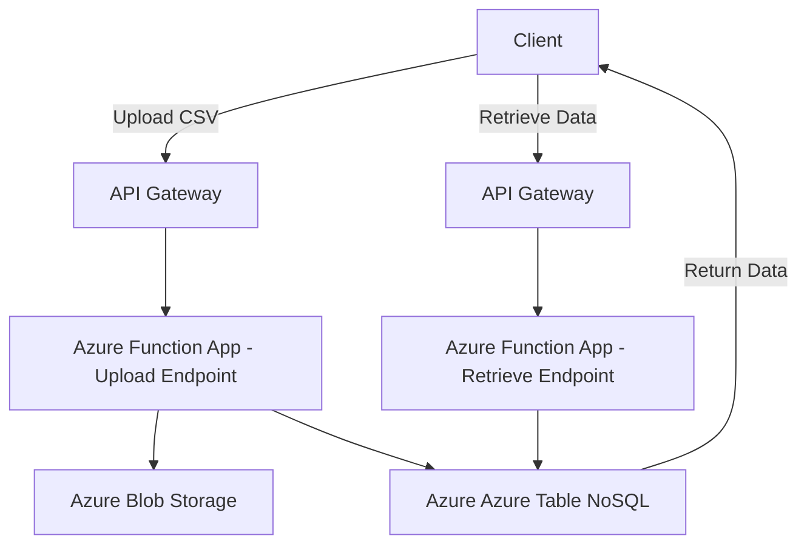

# ApiConnectorConfigFiles

### **Use Case: Implementing a Configurator Manager for CSV File Management**

#### **Business Scenario**
A retail company, **RetailFlex**, operates a product customization platform where customers can configure and order personalized products. The company uses a **Configurator Manager** to manage product configuration data. The configuration data is uploaded as CSV files and stored in a **NoSQL database**. RetailFlex wants an API-based solution to:

1. Upload CSV files to the system.
2. Store the data in a NoSQL database.
3. Return a unique **Batch ID** for tracking purposes.
4. Allow retrieval of stored data using the **Batch ID**.

This solution should handle large datasets, ensure data integrity, and be scalable for future growth.

---

### **Solution Overview**

1. **API Endpoints**:
   - **Upload CSV**: Accepts a CSV file, processes it, stores the data in a NoSQL database, and returns a `Batch ID`.
   - **Retrieve Data by Batch ID**: Fetches data from the NoSQL database using the `Batch ID`.

2. **Technology Stack**:
   - **API Management**: Azure API Management (APIM).
   - **Database**: Azure Azure Table NoSQL (NoSQL database).
   - **Serverless Functions**: Azure Function App for processing CSV uploads and handling API requests.
   - **Storage**: Azure Blob Storage for temporary CSV file storage before processing.
   - **Programming Language**: Python or Node.js.

---

### **API Workflow**

#### **1. CSV Upload Workflow**

- **Input**: CSV file via POST request to the API endpoint `/upload`.
- **Processing Steps**:
  1. Validate the uploaded CSV file (e.g., check headers, format).
  2. Save the CSV file temporarily in Azure Blob Storage.
  3. Parse the CSV file into records.
  4. Generate a unique `Batch ID` (UUID or timestamp-based).
  5. Insert records into Azure Azure Table NoSQL under the corresponding `Batch ID`.
  6. Return the `Batch ID` as a response to the API call.

#### **2. Data Retrieval Workflow**

- **Input**: `Batch ID` via GET request to the API endpoint `/retrieve/{batch_id}`.
- **Processing Steps**:
  1. Query Azure Azure Table NoSQL for records associated with the `Batch ID`.
  2. Return the data as a JSON response.

---

### **Detailed Steps**

#### **1. Upload CSV Endpoint**

**Endpoint**: `/upload`  
**Method**: POST  
**Request**:
```json
{
  "file": "CSV file as multipart/form-data"
}
```

**Response**:
```json
{
  "status": "success",
  "batch_id": "123e4567-e89b-12d3-a456-426614174000"
}
```

**Logic**:
- Use Azure Blob Storage SDK to store the file temporarily.
- Parse the file using a library like Pandas (Python) or csv-parser (Node.js).
- Generate a `Batch ID`.
- Store each record in Azure Table NoSQL with the `Batch ID`.

---


**Logic**:
- Query Azure Table NoSQL for all records matching the `Batch ID`.
- Format and return the results as JSON.

---

### **Example Code**

#### **Upload CSV API (Python)**

```python
import uuid
import pandas as pd
from azure.storage.blob import BlobServiceClient
from azure.cosmos import CosmosClient

# Azure Blob and Azure Table NoSQL initialization
blob_service_client = BlobServiceClient.from_connection_string("AzureBlobConnectionString")
cosmos_client = CosmosClient("AzureCosmosEndpoint", "AzureCosmosKey")
database = cosmos_client.get_database_client("configurator")
container = database.get_container_client("batch_data")

def upload_csv(file):
    # Generate Batch ID
    batch_id = str(uuid.uuid4())
    
    # Save file to Blob Storage
    blob_client = blob_service_client.get_blob_client(container="csv-container", blob=f"{batch_id}.csv")
    blob_client.upload_blob(file)
    
    # Parse CSV
    df = pd.read_csv(file)
    records = df.to_dict(orient="records")
    
    # Insert into Azure Table NoSQL
    for record in records:
        record["batch_id"] = batch_id
        container.upsert_item(record)
    
    return {"status": "success", "batch_id": batch_id}
```

---

#### **Retrieve Data API (Python)**

```python
def retrieve_data(batch_id):
    query = f"SELECT * FROM c WHERE c.batch_id = '{batch_id}'"
    items = list(container.query_items(query=query, enable_cross_partition_query=True))
    return {"status": "success", "data": items}
```

---

### **Architecture Diagram**



---

### **Key Benefits**
- **Scalability**: Azure Table NoSQL handles large datasets.
- **Flexibility**: APIs enable integration with other services.
- **Traceability**: Unique `Batch ID` tracks data upload and retrieval.
- **Security**: Azure services ensure secure data handling.

Would you like further expansion on implementation or enhancements?
