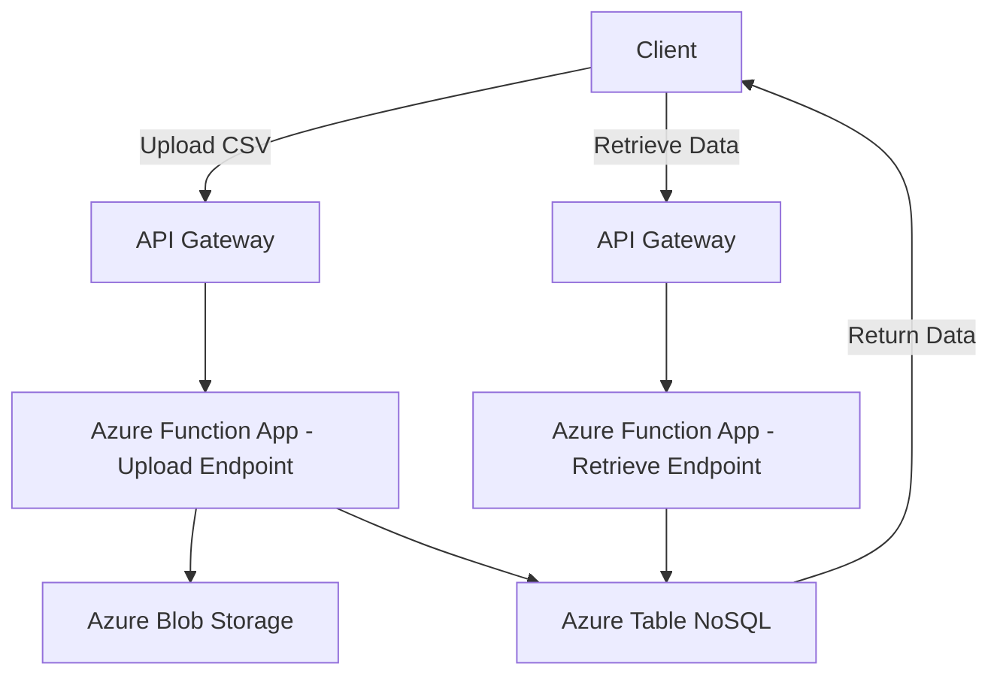

# ApiConnectorConfigFiles

### **Use Case: Implementing a Configurator Manager for CSV File Management**

#### **Business Scenario**
A retail company, **RetailFlex**, operates a product customization platform where customers can configure and order personalized products. The company uses a **Configurator Manager** to manage product configuration data. The configuration data is uploaded as CSV files and stored in a **NoSQL database**. RetailFlex wants an API-based solution to:

1. Upload CSV files to the system.
2. Store the data in a NoSQL database.
3. Return a unique **Batch ID** for tracking purposes.
4. Allow retrieval of stored data using the **Batch ID**.

This solution should handle large datasets, ensure data integrity, and be scalable for future growth.

---

### **Solution Overview**

1. **API Endpoints**:
   - **Upload CSV**: Accepts a CSV file, processes it, stores the data in a NoSQL database, and returns a `Batch ID`.
   - **Retrieve Data by Batch ID**: Fetches data from the NoSQL database using the `Batch ID`.

2. **Technology Stack**:
   - **API Management**: Azure API Management (APIM). RECOMMENDED FOR PROD ENVIRONMENTS
   - **Database**: Azure Table NoSQL (NoSQL database).
   - **Serverless Functions**: Azure Function App for processing CSV uploads and handling API requests.
   - **Storage**: Azure Blob Storage for temporary CSV file storage before processing.
   - **Programming Language**: C#

---

### **API Workflow**

#### **1. CSV Upload Workflow**

- **Input**: CSV file via POST request to the API endpoint `/upload`.
- **Processing Steps**:
  1. Validate the uploaded CSV file (e.g., check headers, format).
  2. Upload CSV file via  API.
  3. Parse the CSV file into records and transform to a JSON Payload
  4. Write the JSON payload into a Azure Table NoSQL Database
  5. Generate a unique `Batch ID` (UUID or timestamp-based).
  6. Return the `Batch ID` as a response to the API call.

#### **2. Data Retrieval Workflow**

- **Input**: `Batch ID` via GET request to the API endpoint `/retrieve/{batch_id}`.
- **Processing Steps**:
  1. Query Azure Table NoSQL for records associated with the `Batch ID`.
  2. Return the data as a JSON response.

---

**Logic**:
- Query Azure Table NoSQL for all records matching the `Batch ID`.
- Format and return the results as JSON.

---

### **Architecture Diagram**

---

### **Key Benefits**
- **Scalability**: Azure Table NoSQL handles large datasets.
- **Flexibility**: APIs enable integration with other services.
- **Traceability**: Unique `Batch ID` tracks data upload and retrieval.
- **Security**: Azure services ensure secure data handling.

